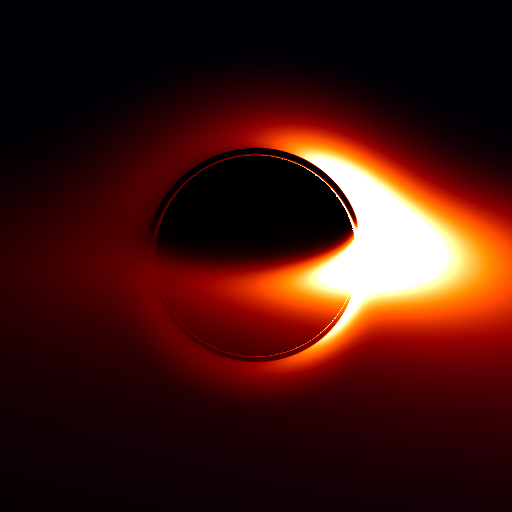
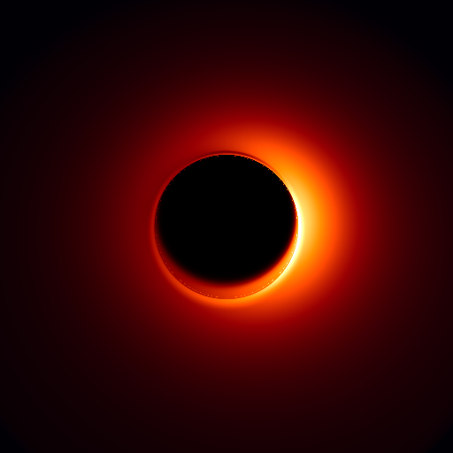
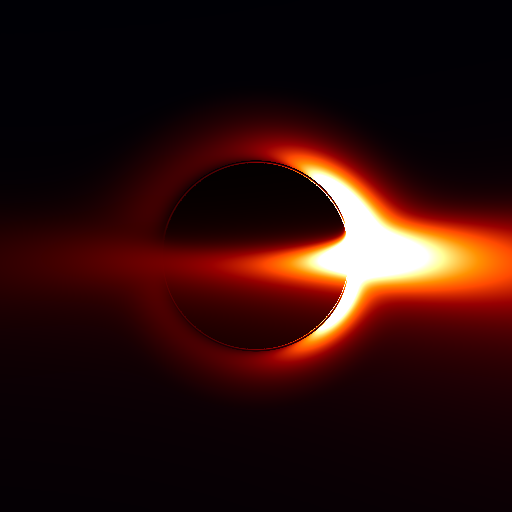
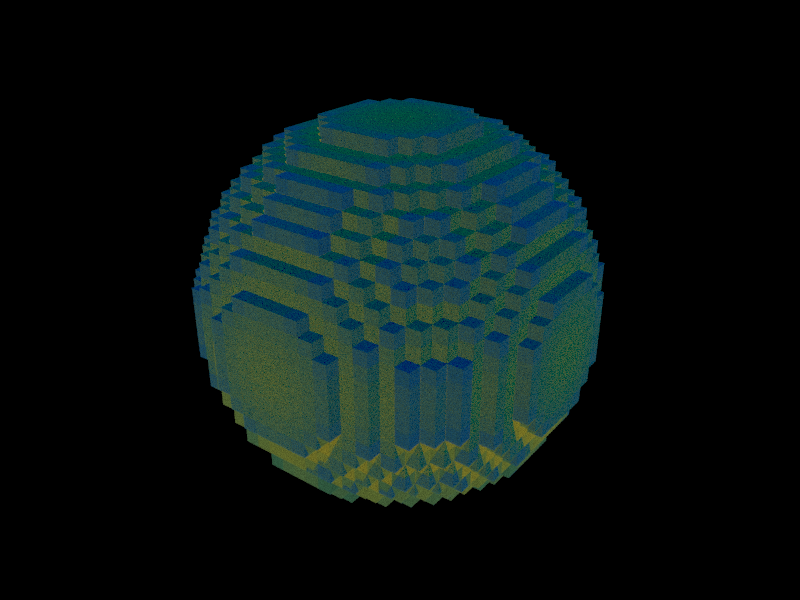
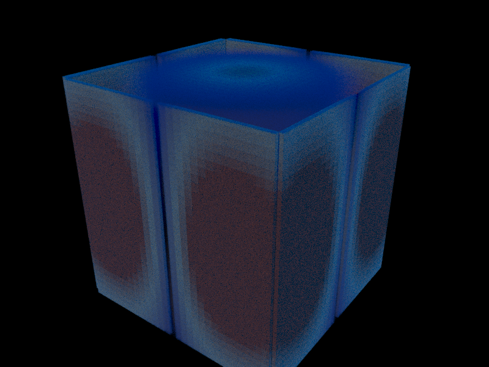
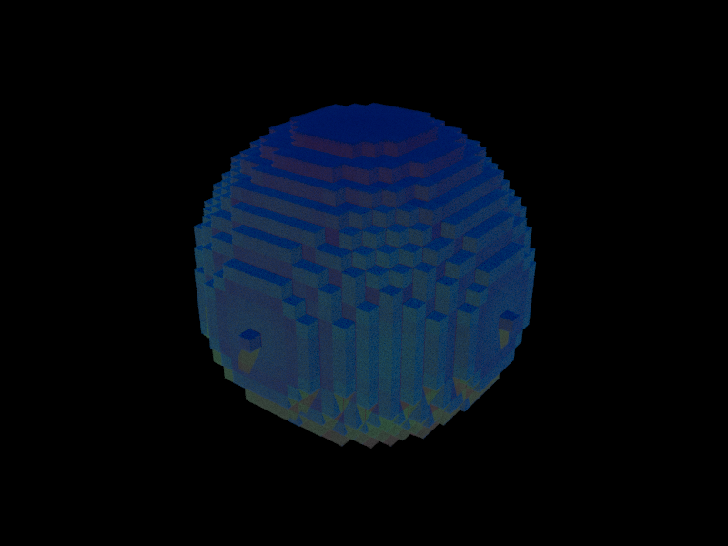
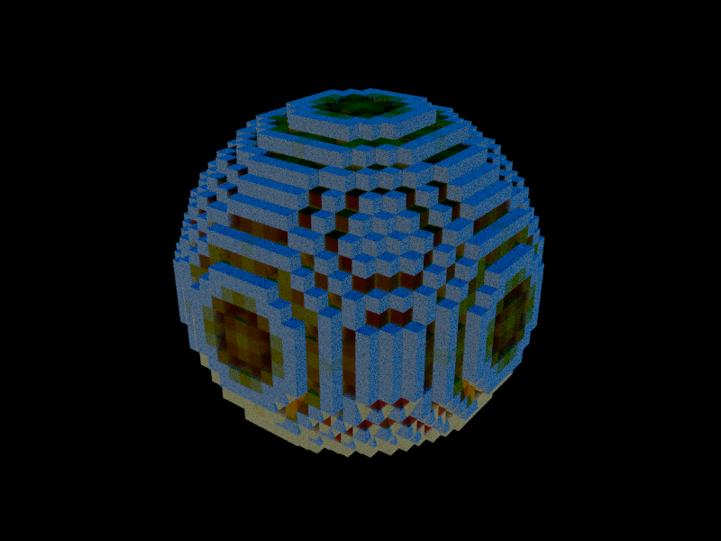

# Lyr.jl

**Physically correct volume rendering in pure Julia.**

Lyr is a from-scratch implementation of the [OpenVDB](https://www.openvdb.org/) file format and a Monte Carlo volume renderer, written entirely in Julia. No C++ bindings, no external renderers — just Julia, from file parsing to final pixel.

<p align="center">
  
  <br/>
  <em>Smoke simulation rendered with stochastic delta tracking and ACES tonemapping</em>
</p>

## Gallery

<table>
  <tr>
    <td align="center"><br/><em>Hydrogen 1s</em></td>
    <td align="center"><br/><em>Hydrogen 2p<sub>z</sub></em></td>
    <td align="center"><br/><em>Hydrogen 3d<sub>x&sup2;-y&sup2;</sub></em></td>
  </tr>
</table>

<p align="center">
  
  <br/>
  <em>Larmor precession of a hydrogen 1s + 2p<sub>x</sub> superposition in a magnetic field, decaying via spontaneous emission. Lindblad master equation, Tr(&rho;) = 1 exactly.</em>
</p>

The hydrogen orbital visualizations compute analytical wavefunctions (associated Laguerre polynomials, complex spherical harmonics) and render the probability density |&psi;|&sup2; as volumetric fog. The precession animation solves the full Lindblad master equation with jump operators L<sub>m</sub> = |1s&rang;&lang;2p<sub>m</sub>| — probability is exactly conserved at every frame.

### General Relativistic Ray Tracing

<p align="center">
  
  <br/>
  <em>Schwarzschild black hole with volumetric thick disk — geodesic ray tracing in Cartesian Kerr-Schild coordinates, emission-absorption with relativistic redshift and Doppler beaming.</em>
</p>

<table>
  <tr>
    <td align="center"><br/><em>Oblique view</em></td>
    <td align="center"><br/><em>Face-on (polar)</em></td>
    <td align="center"><br/><em>Edge-on</em></td>
  </tr>
</table>

The GR module traces null geodesics backward from camera to source through curved spacetime. Schwarzschild and Cartesian Kerr-Schild metrics are implemented with analytic Christoffel symbols (no automatic differentiation). Thick disk emission uses the Shakura-Sunyaev temperature profile with bremsstrahlung-inspired emissivity. Frequency shift is computed from the ratio of photon 4-momentum contracted with emitter/observer 4-velocities.

### Scattering Physics

<table>
  <tr>
    <td align="center"><br/><em>e-e Coulomb (small b)</em></td>
    <td align="center"><br/><em>Scalar QED</em></td>
    <td align="center"><br/><em>H-H excitation</em></td>
  </tr>
</table>

A six-scenario scattering series from H-H elastic collisions through tree-level scalar QED with virtual photon exchange. All physics is analytic — Gaussian wavepackets convolved with known propagators, rendered through the volume pipeline.

### Volume Rendering and Grid Operations

<table>
  <tr>
    <td align="center"><br/><em>CSG union</em></td>
    <td align="center"><br/><em>CSG intersection</em></td>
    <td align="center"><br/><em>Mesh to SDF</em></td>
    <td align="center"><br/><em>CSG sculpture</em></td>
  </tr>
</table>

<table>
  <tr>
    <td align="center"><br/><em>Gradient</em></td>
    <td align="center"><br/><em>Divergence</em></td>
    <td align="center"><br/><em>Curl</em></td>
    <td align="center"><br/><em>Laplacian</em></td>
  </tr>
</table>

<table>
  <tr>
    <td align="center"><br/><em>Single scattering</em></td>
    <td align="center"><br/><em>Multiple scattering</em></td>
    <td align="center"><br/><em>NLM denoising</em></td>
  </tr>
</table>

## Why Lyr?

Most scientific visualization tools treat rendering as an afterthought — a black box that turns data into pixels. Lyr takes the opposite approach: the rendering itself is the physics.

- **Physically correct**: Monte Carlo delta tracking with ratio-tracking shadow rays. No shortcuts, no approximations beyond the single-scattering model.
- **Pure Julia**: From binary VDB parsing to GPU kernels, everything is Julia. Full type stability, zero-allocation hot paths, and you can `@code_warntype` the entire pipeline.
- **GPU-ready**: NanoVDB flat-buffer layout with [KernelAbstractions.jl](https://github.com/JuliaGPU/KernelAbstractions.jl) kernels — runs on CPU, CUDA, ROCm, and Metal.
- **The noise is the signal**: Low sample-count Monte Carlo renders have a film-grain quality that reveals the stochastic nature of the physics. This is intentional.

Inspired by [Nils Berglund's](https://www.youtube.com/@NilsBerglund) mathematical physics visualizations — the idea that beautiful mathematics deserves beautiful rendering.

## Features

| Category | What |
|----------|------|
| **VDB I/O** | Full OpenVDB read (v220-v226) and write (v224). Zlib + Blosc compression. Multi-grid files. Half-precision, vec3, Float32/64. |
| **Volume Rendering** | Delta tracking (free-flight sampling), ratio tracking (shadow transmittance), single-scatter lighting, transfer functions, phase functions (isotropic, Henyey-Greenstein). |
| **Post-Processing** | Non-local means denoising, bilateral filtering, tonemapping (ACES filmic, Reinhard, exposure), PNG/EXR output. |
| **GPU** | NanoVDB flat-buffer with KernelAbstractions.jl delta tracking kernel. Progressive accumulation. CPU fallback. |
| **Grid Construction** | `build_grid` from sparse `Dict{Coord, T}`. `gaussian_splat` for particle-to-volume. Level-set primitives (sphere, box). CSG (union, intersection, difference). Particles-to-SDF. |
| **Mesh Operations** | `mesh_to_level_set` for closed manifold meshes. Marching cubes meshing (`volume_to_mesh`). SDF-to-fog and fog-to-SDF conversion. |
| **Surface Rendering** | DDA hierarchical ray traversal (Amanatides-Woo), level-set sphere tracing, trilinear interpolation. |
| **Differential Operators** | Gradient, divergence, curl, Laplacian, mean curvature on VDB grids. Fast sweeping. Morphology (dilate, erode). Segmentation. |
| **General Relativity** | Null geodesic ray tracing (RK4 + Verlet). Schwarzschild (Boyer-Lindquist + Cartesian Kerr-Schild). Thin and thick accretion disk models. Gravitational redshift + Doppler beaming. Volumetric emission-absorption through curved spacetime. |
| **Quantum Physics** | Hydrogen atom wavefunctions (any n,l,m). Molecular orbitals (H2 bonding/antibonding). Lindblad master equation for open quantum systems. Larmor precession. |
| **Scalar QED** | Tree-level Dyson series for charged scalar particles. Born approximation with FFT convolution. Virtual photon exchange (Poisson-solved Coulomb cross-energy). Momentum-space propagation. |
| **Wavepackets** | Gaussian wavepacket propagation. FFT convolution infrastructure. Morse and Kratzer-Wang potentials. Nuclear trajectory integration. Scattering fields. |
| **Field Protocol** | `ScalarField3D`, `VectorField3D`, `ComplexScalarField3D`, `ParticleField`, `TimeEvolution` — define physics, get rendered. One-call `visualize()` pipeline. |
| **Animation** | Frame-by-frame rendering pipeline. Camera modes (fixed, orbit, follow, function). Transfer function presets (electron, photon, excited state). ffmpeg integration via `stitch_to_mp4`. |

## Quick Start

```julia
using Lyr

# Parse a VDB file
vdb = parse_vdb("smoke.vdb")
grid = vdb.grids[1]

# Build GPU-friendly flat buffer
nanogrid = build_nanogrid(grid.tree)

# Set up the scene
camera = Camera((300.0, 200.0, 300.0), (0.0, 0.0, 0.0), (0.0, 1.0, 0.0), 40.0)
tf = tf_blackbody()
material = VolumeMaterial(tf; sigma_scale=1.0, emission_scale=2.0, scattering_albedo=0.6)
volume = VolumeEntry(grid, nanogrid, material)
light = DirectionalLight((0.6, 0.8, 1.0), (2.5, 2.5, 2.5))
scene = Scene(camera, light, volume; background=(0.01, 0.01, 0.02))

# Render with Monte Carlo delta tracking
pixels = render_volume_image(scene, 1920, 1080; spp=4)

# Post-process and save
pixels = denoise_bilateral(pixels)
pixels = tonemap_aces(pixels)
write_png("output.png", pixels)
```

See [docs/usage.md](docs/usage.md) for the full guide.

## Architecture

```
VDB File ──parse_vdb──> Grid{T} ──build_nanogrid──> NanoGrid{T}
                          |                              |
                     Tree structure               Flat GPU buffer
                     (Root>I2>I1>Leaf)            (byte offsets)
                          |                              |
                          +──────── Scene <──────────────+
                                     |
                          render_volume_image (MC delta tracking)
                          render_volume_preview (deterministic)
                          gpu_render_volume (KernelAbstractions.jl)
                                     |
                              Matrix{NTuple{3,T}}
                                     |
                        denoise ──> tonemap ──> write_png/exr

Field Protocol:
  ScalarField3D / VectorField3D / ComplexScalarField3D / ParticleField
                          |
                     voxelize() ──> Grid{Float32} ──> visualize()

GR Module:
  MetricSpace (Schwarzschild, SchwarzschildKS)
       |
  GRCamera + IntegratorConfig + MatterSource (ThinDisk, ThickDisk)
       |
  gr_render_image() ── null geodesic integration ──> pixels

Scalar QED:
  MomentumGrid + ScalarQEDScattering
       |
  Born approximation ── FFT convolution ── Poisson EM cross-energy
       |
  render_animation() + stitch_to_mp4() ──> video
```

## Project Status

| Phase | Status | Key Components |
|-------|--------|----------------|
| 1. Foundation | **Complete** | VDB read/write, DDA traversal, NanoVDB flat layout |
| 2. Volume Renderer | **Complete** | Delta/ratio tracking, transfer functions, scene graph, PNG/EXR output, multi-threaded |
| 3. GPU Acceleration | **~85%** | KA delta tracking kernel, NLM + bilateral denoising. CUDA dependency in progress |
| 4. Creation Tools | **Complete** | Grid builder, Gaussian splatting, Field Protocol (5 field types), CSG, mesh-to-SDF, particles-to-SDF |
| 5. GR Ray Tracing | **~90%** | Schwarzschild (BL + KS), RK4/Verlet, thin/thick disk, redshift, volumetric emission-absorption, geodesic tracing. Missing: Kerr metric |
| 6. Ecosystem/Physics | **Active** | Hydrogen orbitals, Lindblad master eq, Ising model, MD demos, scattering series (e-e Coulomb, H-H elastic/excitation/ionization, scalar QED Born approximation, Moller scattering) |

94,000+ tests passing. See [VISION.md](VISION.md) for the full roadmap.

## Installation

```julia
# From the Julia REPL
] add https://github.com/tobiasosborne/Lyr.jl

# Or clone and develop
git clone https://github.com/tobiasosborne/Lyr.jl
cd Lyr.jl
julia --project -e 'using Pkg; Pkg.instantiate()'
```

## Running Tests

```julia
julia --project -e 'using Pkg; Pkg.test()'
# 94,000+ tests, ~4 minutes
```

## License

[Apache License 2.0](LICENSE)

## Acknowledgements

- [OpenVDB](https://www.openvdb.org/) by DreamWorks Animation for the file format specification
- [TinyVDBIO](https://github.com/syoyo/tinyvdbio) by Syoyo Fujita for the reference C++ parser
- [Nils Berglund](https://www.youtube.com/@NilsBerglund) for the inspiration that mathematical physics deserves beautiful visualization
- Built with significant assistance from [Claude Code](https://claude.ai/claude-code) (Anthropic)
