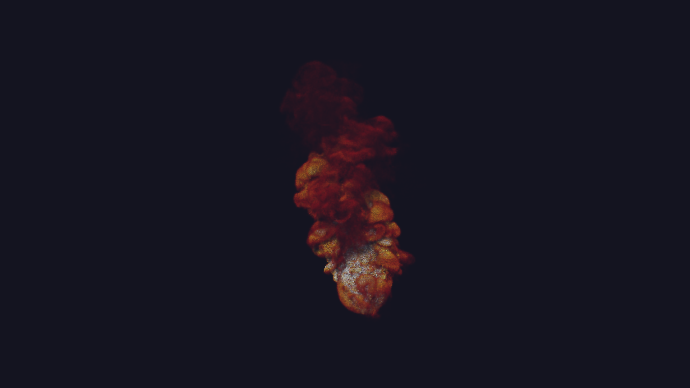
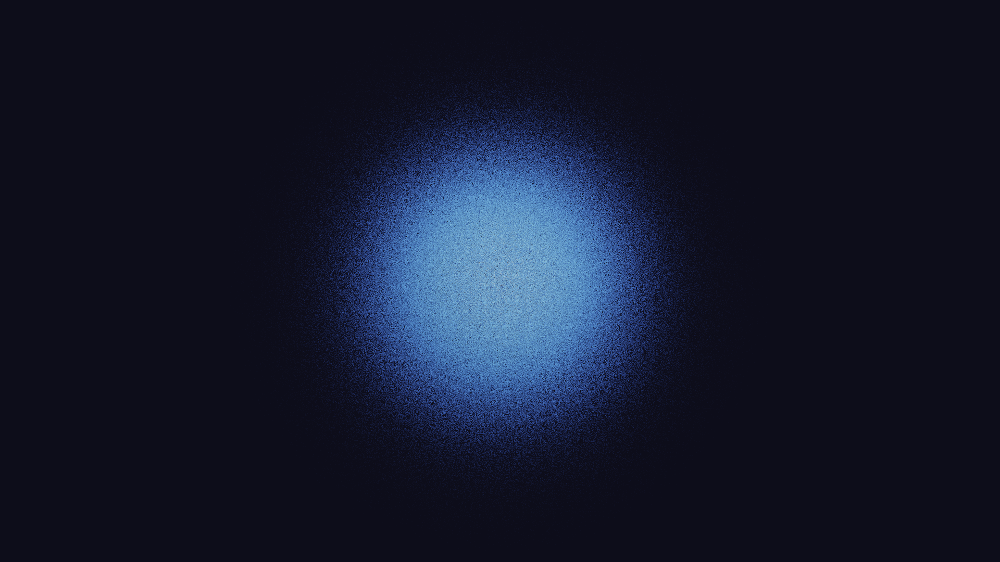
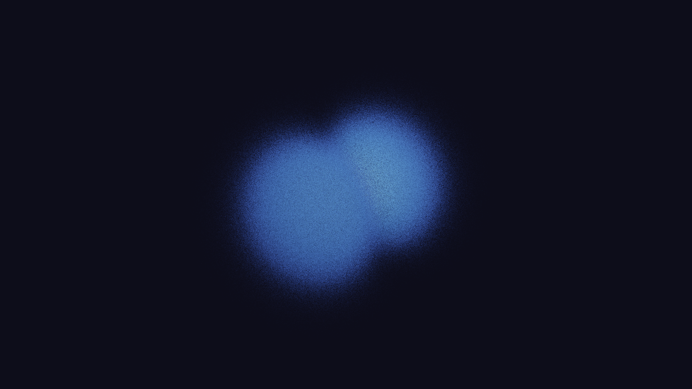
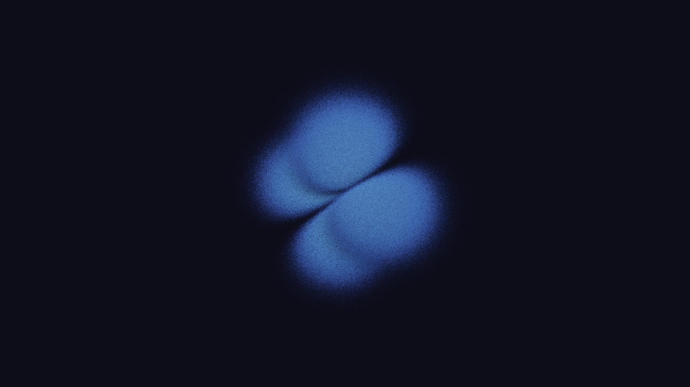
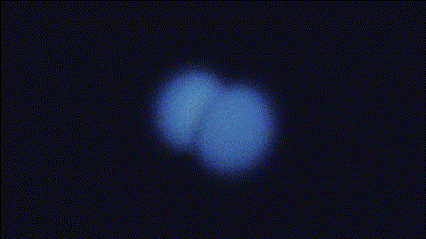

# Lyr.jl

**Physically correct volume rendering in pure Julia.**

Lyr is a from-scratch implementation of the [OpenVDB](https://www.openvdb.org/) file format and a Monte Carlo volume renderer, written entirely in Julia. No C++ bindings, no external renderers — just Julia, from file parsing to final pixel.

<p align="center">
  
  <br/>
  <em>Smoke simulation rendered with stochastic delta tracking and ACES tonemapping</em>
</p>

## Gallery

<table>
  <tr>
    <td align="center"><br/><em>Hydrogen 1s</em></td>
    <td align="center"><br/><em>Hydrogen 2p<sub>z</sub></em></td>
    <td align="center"><br/><em>Hydrogen 3d<sub>x&sup2;-y&sup2;</sub></em></td>
  </tr>
</table>

<p align="center">
  
  <br/>
  <em>Larmor precession of a hydrogen 1s + 2p<sub>x</sub> superposition in a magnetic field, decaying via spontaneous emission. Lindblad master equation, Tr(&rho;) = 1 exactly.</em>
</p>

The hydrogen orbital visualizations compute analytical wavefunctions (associated Laguerre polynomials, complex spherical harmonics) and render the probability density |&psi;|&sup2; as volumetric fog. The precession animation solves the full Lindblad master equation with jump operators L<sub>m</sub> = |1s&rang;&lang;2p<sub>m</sub>| — probability is exactly conserved at every frame.

## Why Lyr?

Most scientific visualization tools treat rendering as an afterthought — a black box that turns data into pixels. Lyr takes the opposite approach: the rendering itself is the physics.

- **Physically correct**: Monte Carlo delta tracking with ratio-tracking shadow rays. No shortcuts, no approximations beyond the single-scattering model.
- **Pure Julia**: From binary VDB parsing to GPU kernels, everything is Julia. Full type stability, zero-allocation hot paths, and you can `@code_warntype` the entire pipeline.
- **GPU-ready**: NanoVDB flat-buffer layout with [KernelAbstractions.jl](https://github.com/JuliaGPU/KernelAbstractions.jl) kernels — runs on CPU, CUDA, ROCm, and Metal.
- **The noise is the signal**: Low sample-count Monte Carlo renders have a film-grain quality that reveals the stochastic nature of the physics. This is intentional.

Inspired by [Nils Berglund's](https://www.youtube.com/@NilsBerglund) mathematical physics visualizations — the idea that beautiful mathematics deserves beautiful rendering.

## Features

| Category | What |
|----------|------|
| **VDB I/O** | Full OpenVDB read (v220-v226) and write (v224). Zlib + Blosc compression. Multi-grid files. Half-precision, vec3, Float32/64. |
| **Volume Rendering** | Delta tracking (free-flight sampling), ratio tracking (shadow transmittance), single-scatter lighting, transfer functions, phase functions (isotropic, Henyey-Greenstein). |
| **Post-Processing** | Non-local means denoising, bilateral filtering, tonemapping (ACES filmic, Reinhard, exposure), PNG/EXR output. |
| **GPU** | NanoVDB flat-buffer with KernelAbstractions.jl delta tracking kernel. Progressive accumulation. CPU fallback. |
| **Grid Construction** | `build_grid` from sparse `Dict{Coord, T}`. `gaussian_splat` for particle-to-volume conversion. |
| **Surface Rendering** | DDA hierarchical ray traversal (Amanatides-Woo), level-set sphere tracing, trilinear interpolation. |
| **Quantum Physics** | Hydrogen atom wavefunctions (any n,l,m). Lindblad master equation for open quantum systems. Larmor precession. |

## Quick Start

```julia
using Lyr

# Parse a VDB file
vdb = parse_vdb("smoke.vdb")
grid = vdb.grids[1]

# Build GPU-friendly flat buffer
nanogrid = build_nanogrid(grid.tree)

# Set up the scene
camera = Camera((300.0, 200.0, 300.0), (0.0, 0.0, 0.0), (0.0, 1.0, 0.0), 40.0)
tf = tf_blackbody()
material = VolumeMaterial(tf; sigma_scale=1.0, emission_scale=2.0, scattering_albedo=0.6)
volume = VolumeEntry(grid, nanogrid, material)
light = DirectionalLight((0.6, 0.8, 1.0), (2.5, 2.5, 2.5))
scene = Scene(camera, light, volume; background=(0.01, 0.01, 0.02))

# Render with Monte Carlo delta tracking
pixels = render_volume_image(scene, 1920, 1080; spp=4)

# Post-process and save
pixels = denoise_bilateral(pixels)
pixels = tonemap_aces(pixels)
write_png("output.png", pixels)
```

See [docs/usage.md](docs/usage.md) for the full guide.

## Architecture

```
VDB File ──parse_vdb──▶ Grid{T} ──build_nanogrid──▶ NanoGrid{T}
                          │                              │
                     Tree structure               Flat GPU buffer
                     (Root→I2→I1→Leaf)            (byte offsets)
                          │                              │
                          └──────── Scene ◀──────────────┘
                                     │
                          render_volume_image (MC delta tracking)
                          render_volume_preview (deterministic)
                                     │
                              Matrix{NTuple{3,Float64}}
                                     │
                        denoise ──▶ tonemap ──▶ write_png
```

## Project Status

| Phase | Status | Key Components |
|-------|--------|----------------|
| 1. Foundation | **Complete** | VDB read/write, DDA traversal, NanoVDB flat layout |
| 2. Volume Renderer | **~90%** | Delta/ratio tracking, TF, scene, PNG/EXR output |
| 3. GPU Acceleration | **~80%** | Delta tracking kernel, NLM + bilateral denoising |
| 4. Creation Tools | Partial | Grid builder, Gaussian splatting. Missing: mesh-to-SDF, CSG |
| 5. Ecosystem | Started | Hydrogen orbitals, MD demos. Missing: Makie recipe, multi-scatter |

10,410+ tests passing. See [VISION.md](VISION.md) for the full roadmap.

## Installation

```julia
# From the Julia REPL
] add https://github.com/tobiasosborne/Lyr.jl

# Or clone and develop
git clone https://github.com/tobiasosborne/Lyr.jl
cd Lyr.jl
julia --project -e 'using Pkg; Pkg.instantiate()'
```

## Running Tests

```julia
julia --project -e 'using Pkg; Pkg.test()'
# 10,410+ tests, ~3 minutes
```

## License

[Apache License 2.0](LICENSE)

## Acknowledgements

- [OpenVDB](https://www.openvdb.org/) by DreamWorks Animation for the file format specification
- [TinyVDBIO](https://github.com/syoyo/tinyvdbio) by Syoyo Fujita for the reference C++ parser
- [Nils Berglund](https://www.youtube.com/@NilsBerglund) for the inspiration that mathematical physics deserves beautiful visualization
- Built with significant assistance from [Claude Code](https://claude.ai/claude-code) (Anthropic)
